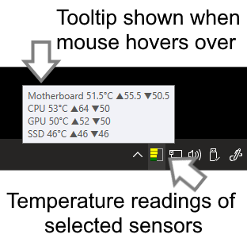
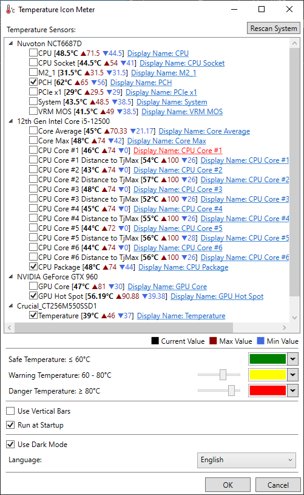

**Temperature Icon Meter** is a small notifyicon system temperature meter for MS Windows, running on Microsoft Windows 7 or above using the Microsoft .NET Framework.

This is a by-product of my another project [Icon-Meter](https://oscarkcau.github.io/Icon-Meter/). It displays small notifyicon which visualize the user selected current temperature readings in small bars. Also it will record the minimum and maximum temperature readings during its running. The temperature readings is collected via WMI interface provided by [Open Hardware Monitor](https://github.com/openhardwaremonitor/openhardwaremonitor).
Temperature Icon Meter has the following features:

* (Version 2.3.2) Provide buttons for moving popup window and pinning popup window on top.
* (Version 2.3.1) Introduce popup window to replace simple tooltip text and display all detected temperature information.
* (Version 2.1) Multi-language support (traditional Chinese, simplified Chinese, English and Japanese).
* (Version 2.0) Reimplement using WPF for better support for Windows 10
* Customizable bar colors for safe / warning / danger temperatures ranges.
* Customizable temperature ranges (safe / warning / danger).
* Customizable display names for any detected temperature sensors.
* Use vertical or horizontal bars
* Autostart when Windows start up
* Display numerical readings in popup tooltip message when mouse cursor hovers over the meter

## Installation

Download and run the latest [installer](https://github.com/oscarkcau/Temperature-Icon-Meter/releases/latest).

## Usage

* Left click the meter icon to show the popup window. 
* Right click the meter icon to access the setup dialog (**setup** menu item), or to close the program (**Close** menu item).
* Select the check box of a temperature sensor to include it in the notifyicon and make it highlighted in the popup window.
* Click the blue link to edit the display name of any temperature sensor, the display name will be shown in the popup tooltip and popup window.
* Currently 4 languages (traditional Chinese, simplified Chinese, English and Japanese) are supported, you can select your desired language in the setup dialog.
* All settings could be found in the setup dialog.

## Important Notes
* Temperature Icon Meter needs user to confirm the UAC (User Account Control) prompt during its first run, and it should start automatically without interruption next time if you enable the **Run at Startup** option.
* Temperature Icon Meter may not be able to detect all temperature sensors of any system and ensure all sensors report the correct temperature readings, since all readings are collected via the third-party library provied by [Open Hardware Monitor](https://github.com/openhardwaremonitor/openhardwaremonitor). To support more and newer hardward, if possible I will provide new versions of Temperature Icon Meter when there is a new update of the external library. For the full list of supported hardward, please visit the website of [Open Hardware Monitor](https://openhardwaremonitor.org/documentation/)

